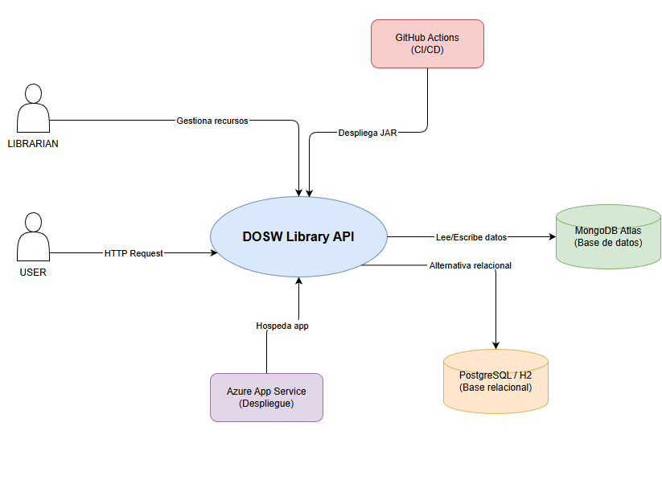
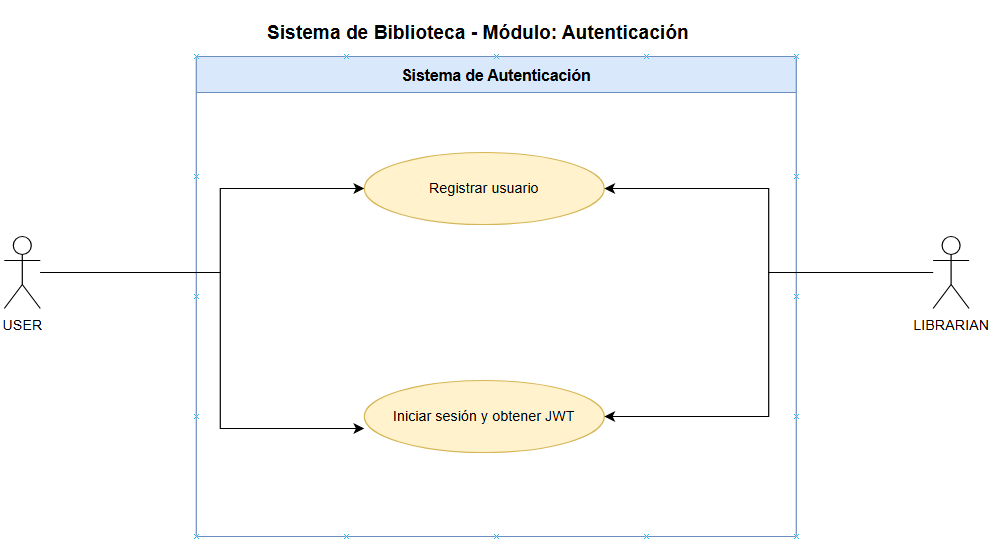
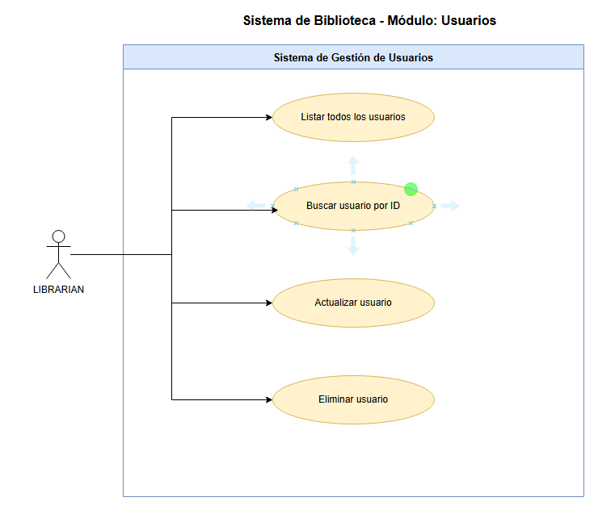
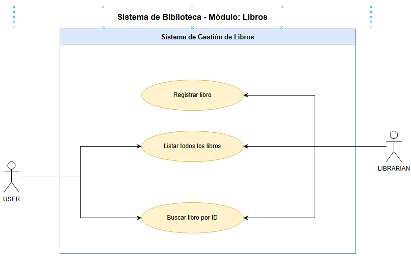
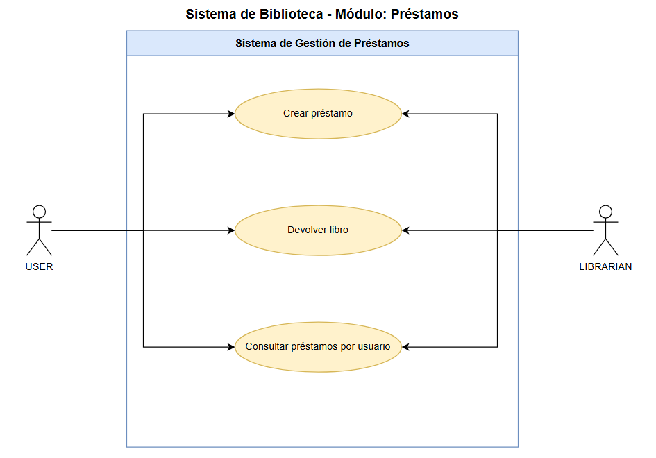
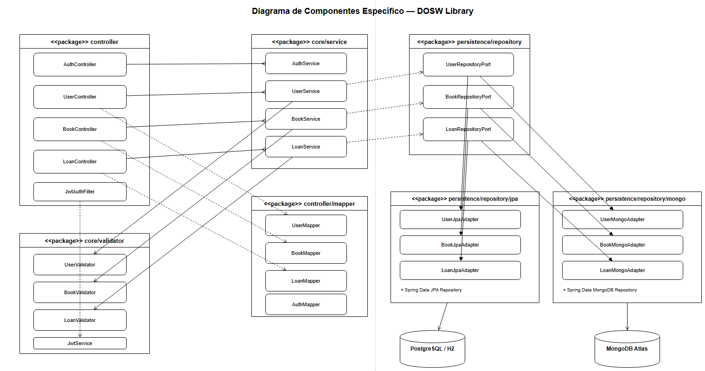
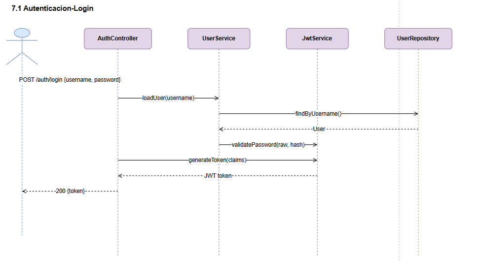
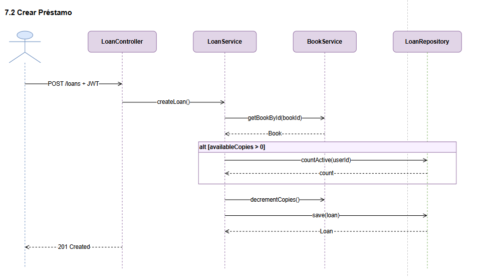
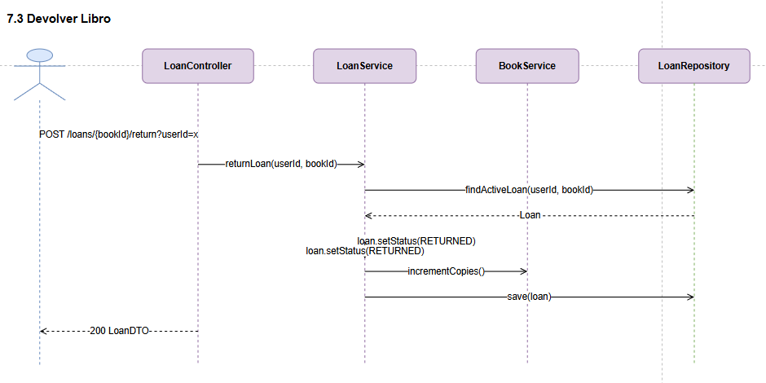
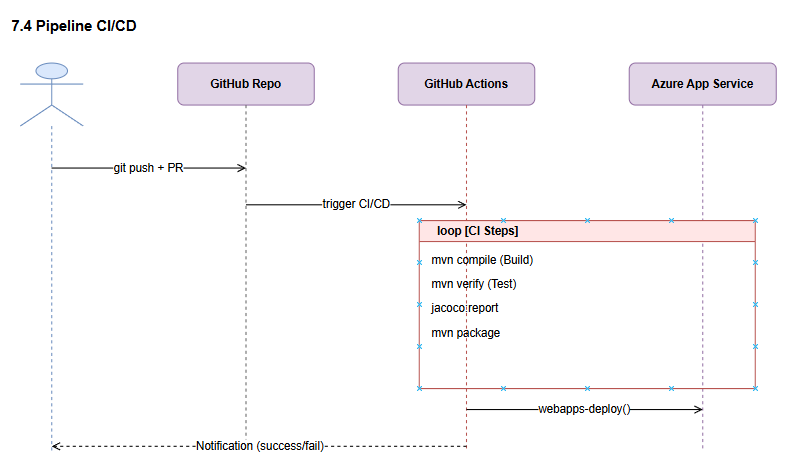

# High Level Design – DOSW Library Backend

> **Versión:** 1.0 | **Fecha:** Abril 2026 | **Autor:** Andres Camilo Vivas Baquero  
> **Institución:** Escuela Colombiana de Ingeniería Julio Garavito

---

## Tabla de Contenidos

1. [Descripción del Servicio](#1-descripción-del-servicio)
2. [Tecnologías a Usar](#2-tecnologías-a-usar)
3. [Funcionalidades y Casos de Uso](#3-funcionalidades-y-casos-de-uso)
4. [Diagramas](#4-diagramas)
5. [Funcionalidades Expuestas](#5-funcionalidades-expuestas)
6. [Manejo de Errores](#6-manejo-de-errores)
7. [Diagramas de Secuencia](#7-diagramas-de-secuencia)
8. [Bibliografía](#8-bibliografía)

---

## 1. Descripción del Servicio

### 1.1 Descripción General

**DOSW Library** es una API REST para la gestión integral de una biblioteca digital. El sistema permite administrar usuarios, libros y préstamos, simulando el funcionamiento real de una biblioteca con soporte para autenticación segura mediante JWT y persistencia dual en bases de datos relacionales (PostgreSQL/H2) y no relacionales (MongoDB Atlas).

El servicio está desplegado en **Azure App Service** y se integra con un pipeline de **CI/CD** en GitHub Actions que automatiza la compilación, pruebas, análisis de código y despliegue continuo.

### 1.2 Diagrama de Contexto



| Actor | Descripción |
|---|---|
| Usuario (USER) | Consulta libros y gestiona sus propios préstamos |
| Bibliotecario (LIBRARIAN) | Administra libros, usuarios y todos los préstamos |
| GitHub Actions | Automatiza build, test y deploy |
| Azure App Service | Hospeda y ejecuta la aplicación en producción |
| MongoDB Atlas | Persiste datos en producción (no relacional) |
| PostgreSQL / H2 | Persiste datos en ambiente relacional y pruebas |

---

## 2. Tecnologías a Usar

| Categoría | Tecnología | Versión | Propósito |
|---|---|---|---|
| **Lenguaje** | Java | 21 | Lenguaje principal de desarrollo |
| **Framework** | Spring Boot | 3.2.5 | Framework principal de la aplicación |
| **Seguridad** | Spring Security | 6.x | Autenticación y autorización |
| **Auth** | JWT (JJWT) | — | Tokens de autenticación stateless |
| **Encriptación** | BCrypt | — | Hash de contraseñas |
| **Persistencia NoSQL** | Spring Data MongoDB | 3.x | Repositorios MongoDB |
| **Persistencia SQL** | Spring Data JPA / Hibernate | 6.x | Repositorios relacionales |
| **BD Producción** | MongoDB Atlas (M0) | — | Base de datos principal en la nube |
| **BD Alternativa** | PostgreSQL | — | Base de datos relacional |
| **BD Tests** | H2 (in-memory) | — | Base de datos para pruebas unitarias |
| **Build** | Maven | 3.x | Gestión de dependencias y ciclo de vida |
| **Documentación** | Swagger / OpenAPI | 3.0 | Documentación interactiva de la API |
| **Pruebas** | JUnit 5 + Mockito | — | Pruebas unitarias con mocks |
| **Cobertura** | JaCoCo | 0.8.11 | Reporte de cobertura de código |
| **Análisis estático** | Qodana | — | Calidad y revisión estática |
| **CI/CD** | GitHub Actions | — | Pipeline automatizado |
| **Despliegue** | Azure App Service | Free F1 | Hosting en la nube |

---

## 3. Funcionalidades y Casos de Uso

### 3.1 Funcionalidades Identificadas

| Módulo | Funcionalidad | Actor |
|---|---|---|
| **Autenticación** | Registrar usuario | USER / LIBRARIAN |
| **Autenticación** | Iniciar sesión y obtener JWT | USER / LIBRARIAN |
| **Usuarios** | Listar todos los usuarios | LIBRARIAN |
| **Usuarios** | Buscar usuario por ID | LIBRARIAN |
| **Usuarios** | Actualizar usuario | LIBRARIAN |
| **Usuarios** | Eliminar usuario | LIBRARIAN |
| **Libros** | Registrar libro | LIBRARIAN |
| **Libros** | Listar todos los libros | USER / LIBRARIAN |
| **Libros** | Buscar libro por ID | USER / LIBRARIAN |
| **Préstamos** | Crear préstamo | USER / LIBRARIAN |
| **Préstamos** | Devolver libro | USER / LIBRARIAN |
| **Préstamos** | Consultar préstamos por usuario | USER (propio) / LIBRARIAN |

### 3.2 Casos de Uso

***Modulo Autenticación***

HU-01: Como USER/LIBRARIAN quiero registrarme
proporcionando nombre, email y contraseña
para tener acceso al sistema.

Criterios de aceptación:
- Email único y válido
- Contraseña con mínimo 8 caracteres
- Retorna confirmación de registro
- Error si email ya existe

HU-02: Como USER/LIBRARIAN quiero iniciar sesión
con mis credenciales para obtener un JWT
y acceder a los recursos protegidos.

Criterios de aceptación:
- Validar email y contraseña
- Retornar token JWT con expiración
- Error 401 si credenciales incorrectas
- El token incluye el rol del usuario



---

***Modulo Usuarios***

HU-03: Como LIBRARIAN quiero listar todos los usuarios
para ver la información de todos los registrados.

Criterios de aceptación:
- Requiere token JWT con rol LIBRARIAN
- Retorna lista paginada de usuarios
- Incluye: id, nombre, email, rol

HU-04: Como LIBRARIAN quiero buscar un usuario por ID
para ver su información detallada.

Criterios de aceptación:
- Requiere token JWT con rol LIBRARIAN
- Retorna datos completos del usuario
- Error 404 si no existe

HU-05: Como LIBRARIAN quiero actualizar los datos
de un usuario existente.

Criterios de aceptación:
- Requiere token JWT con rol LIBRARIAN
- Permite modificar nombre, email, contraseña
- Email único si se cambia
- Retorna usuario actualizado

HU-06: Como LIBRARIAN quiero eliminar un usuario
del sistema cuando sea necesario.

Criterios de aceptación:
- Requiere token JWT con rol LIBRARIAN
- Elimina usuario por ID
- Error 404 si no existe
- Retorna confirmación de eliminación




--- 

***Modulo Libros***

HU-07: Como LIBRARIAN quiero registrar un libro
para añadirlo al catálogo de la biblioteca.

Criterios de aceptación:
- Requiere token JWT con rol LIBRARIAN
- Campos: título, autor, ISBN, año, cantidad disponible
- ISBN único en el sistema
- Retorna libro creado con su ID

HU-08: Como USER/LIBRARIAN quiero listar todos
los libros disponibles en la biblioteca.

Criterios de aceptación:
- Requiere token JWT válido
- Retorna lista paginada de libros
- Incluye: id, título, autor, disponibilidad

HU-09: Como USER/LIBRARIAN quiero buscar un libro
por ID para ver su información detallada.

Criterios de aceptación:
- Requiere token JWT válido
- Retorna datos completos del libro
- Incluye stock disponible
- Error 404 si no existe




---

***Modulo Prestamos***

HU-10: Como USER/LIBRARIAN quiero crear un préstamo
para registrar que un usuario lleva un libro.

Criterios de aceptación:
- Requiere token JWT válido
- Campos: userId, bookId, fechaDevoluciónEsperada
- Verificar disponibilidad del libro
- Reducir stock disponible
- Retorna préstamo creado con estado ACTIVO

HU-11: Como USER/LIBRARIAN quiero registrar la devolución
de un libro para liberar el stock.

Criterios de aceptación:
- Requiere token JWT válido
- Busca préstamo activo por ID
- Marca préstamo como DEVUELTO
- Incrementa stock disponible del libro
- Registra fecha de devolución real

HU-12: Como USER (propio) quiero consultar mis propios
préstamos para ver el historial.
Como LIBRARIAN quiero consultar préstamos de cualquier
usuario para administrar el sistema.

Criterios de aceptación:
- USER solo accede a sus propios préstamos
- LIBRARIAN puede consultar por cualquier userId
- Retorna historial con estado del préstamo
- Error 403 si USER intenta ver préstamos ajenos




### 3.3 Reglas de Negocio

1. Un libro solo puede prestarse si `availableCopies > 0`.
2. Al prestar, `availableCopies` se decrementa en 1.
3. Un usuario no puede tener más de **3 préstamos ACTIVE** simultáneos.
4. Al devolver, `availableCopies` se incrementa en 1 y el préstamo cambia a `RETURNED`.
5. La contraseña debe tener mínimo **8 caracteres**.
6. El `username` debe ser único en el sistema.

---

## 4. Diagramas

# 4. Diagramas

---

## 4.1 Diagrama ER de Base de Datos — PostgreSQL (Relacional)

Modelo entidad-relación del esquema relacional implementado con **Spring Data JPA** sobre **PostgreSQL** (producción) y **H2** (pruebas). Se definen tres tablas con sus respectivas claves primarias UUID y restricciones de integridad referencial.


**Relaciones:**
- `loans.user_id` → `users.id` (**N:1**) — Un usuario puede tener múltiples préstamos
- `loans.book_id` → `books.id` (**N:1**) — Un libro puede estar en múltiples préstamos

**Restricciones clave:**
- `users.username` — `UNIQUE NOT NULL`
- `books.isbn` — `UNIQUE NOT NULL`
- `loans.status` — `CHECK IN ('ACTIVE', 'RETURNED')`
- `books.available_copies` — `MIN 0`, no puede superar `total_copies`

---

## 4.2 Diagrama ER de Base de Datos — MongoDB (No Relacional)

Modelo de documentos implementado con **Spring Data MongoDB** sobre **MongoDB Atlas M0**. Las colecciones utilizan **referencias por ID** en lugar de documentos embebidos, dado que usuarios y libros tienen ciclo de vida independiente al préstamo.

**Base de datos:** `dosw_library` en MongoDB Atlas (AWS)


---

## 4.3 Diagrama de Clases

Diagrama completo que representa la estructura estática del sistema con **atributos, métodos y relaciones** entre todas las clases. Refleja la arquitectura hexagonal con capas bien diferenciadas por color.

| Clase / Interfaz | Tipo | Capa | Responsabilidad |
|---|---|---|---|
| `UserController` | Clase | Controller | Expone endpoints REST de usuarios |
| `BookController` | Clase | Controller | Expone endpoints REST de libros |
| `LoanController` | Clase | Controller | Expone endpoints REST de préstamos |
| `UserService` | Clase | Service | Lógica de negocio para usuarios |
| `BookService` | Clase | Service | Lógica de negocio para libros |
| `LoanService` | Clase | Service | Lógica de negocio y validación de préstamos |
| `UserRepositoryPort` | Interface | Port | Abstracción de persistencia para usuarios |
| `BookRepositoryPort` | Interface | Port | Abstracción de persistencia para libros |
| `LoanRepositoryPort` | Interface | Port | Abstracción de persistencia para préstamos |
| `User` | Entidad | Domain | Representa un usuario del sistema |
| `Book` | Entidad | Domain | Representa un libro del catálogo |
| `Loan` | Entidad | Domain | Registro de un préstamo |
| `UserMapper` | Clase | Mapper | Convierte entre entidad y DTO de usuario |
| `BookMapper` | Clase | Mapper | Convierte entre entidad y DTO de libro |
| `LoanMapper` | Clase | Mapper | Convierte entre entidad y DTO de préstamo |
| `UserValidator` | Clase | Validator | Valida reglas de negocio para usuarios |
| `BookValidator` | Clase | Validator | Valida disponibilidad y existencia de libros |
| `LoanValidator` | Clase | Validator | Valida condiciones para crear/devolver préstamos |
| `LoanStatus` | Enum | Domain | `ACTIVE`, `RETURNED` |
| `UserRole` | Enum | Domain | `USER`, `LIBRARIAN` |

**Relaciones principales:**
- `Controller` -> `Service` — dependencia directa (uso)
- `Controller` -> `Mapper` — conversión DTO con entidad
- `Service` -> `RepositoryPort` — depende de la abstracción (no la implementación)
- `Service` -> `Validator` — delega validaciones de negocio
- `Loan` -> `User` / `Book` — referencia por ID (asociación)
- `Loan` -> `LoanStatus` — uso del enum de estado


---

## 4.4 Diagrama de Componentes General


Vista de alto nivel de la arquitectura del sistema, dividida en tres módulos principales que siguen el patrón **Hexagonal (Ports & Adapters)**.


| Módulo | Descripción |
|---|---|
| **DOSW LIBRARY WEB** | Capa de presentación: recibe peticiones HTTP, aplica seguridad JWT, transforma DTOs |
| **DOSW LIBRARY CORE** | Núcleo del dominio: lógica de negocio pura, independiente de infraestructura |
| **DATABASE** | Adapters de persistencia: implementaciones JPA y MongoDB de los puertos del core |

---

## 4.5 Diagrama de Componentes Específico


Vista detallada de todos los paquetes y componentes internos, sus dependencias e interfaces. Muestra cómo los adaptadores JPA y MongoDB implementan los mismos puertos, permitiendo intercambiar la base de datos mediante perfiles de Spring.




**Paquetes del proyecto:**

| Paquete | Componentes |
|---|---|
| `controller` | `AuthController`, `UserController`, `BookController`, `LoanController` |
| `controller/mapper` | `UserMapper`, `BookMapper`, `LoanMapper`, `AuthMapper` |
| `core/service` | `AuthService`, `UserService`, `BookService`, `LoanService` |
| `core/security` | `JwtAuthFilter`, `JwtService`, `SecurityConfig` |
| `core/validator` | `UserValidator`, `BookValidator`, `LoanValidator` |
| `core/model` | `User`, `Book`, `Loan`, `LoanStatus`, `UserRole` |
| `core/exception` | Excepciones de negocio personalizadas |
| `persistence/repository` | Interfaces: `UserRepositoryPort`, `BookRepositoryPort`, `LoanRepositoryPort` |
| `persistence/repository/jpa` | `UserJpaAdapter`, `BookJpaAdapter`, `LoanJpaAdapter` |
| `persistence/repository/mongo` | `UserMongoAdapter`, `BookMongoAdapter`, `LoanMongoAdapter` |
| `persistence/dao` | Entidades JPA (`UserDAO`, `BookDAO`, `LoanDAO`) |
| `persistence/document` | Documentos MongoDB (`UserDocument`, `BookDocument`, `LoanDocument`) |
| `config` | Configuraciones por perfil (`JpaConfig`, `MongoConfig`) |


---

## 4.6 Diagrama de Despliegue

Representa la infraestructura física y virtual del sistema en producción, mostrando el flujo desde el desarrollo local hasta el despliegue automático en la nube.


**Tecnologías de infraestructura:**

| Componente | Tecnología | Detalles |
|---|---|---|
| CI/CD | GitHub Actions | Disparado en push/PR a `main` |
| Hosting | Azure App Service | Free F1, Linux, Brazil South |
| Runtime | Java 21 SE | Spring Boot JAR embebido |
| Base de datos | MongoDB Atlas (AWS) | Cluster M0 gratuito |
| Protocolo cliente | HTTPS / REST | Swagger UI incluido |


---

## 5. Funcionalidades Expuestas

### 5.1 Autenticación

#### `POST /auth/register` — Registrar usuario
| Campo | Tipo | Requerido | Restricciones |
|---|---|-----------|---|
| `id` | String | si        | Único, max 255 chars |
| `username` | String | si        | Único en el sistema |
| `password` | String | si        | Min 8 caracteres |
| `name` | String | si        | — |
| `role` | String | si        | Enum: `LIBRARIAN`, `USER` |

**Response 200 OK:**
```json
{ "id": "string", 
  "username": "string", 
  "password": null, 
  "name": "string", 
  "role": "string"
}
```

#### `POST /auth/login` — Iniciar sesión
| Campo | Tipo | Requerido |
|---|---|-----------|
| `username` | String | si        |
| `password` | String | si        |

**Response 200 OK:**
```json
{ "token": "eyJhbGciOiJIUzI1NiJ9.eyJzdWIiOiJ1c2VyMSJ9..." }
```

---

### 5.2 Usuarios (`/users`)

| Método | Endpoint | Request Body | Response | Auth |
|---|---|---|---|---|
| GET | `/users` | — | `List<UserDTO>` | Bearer |
| POST | `/users` | `UserDTO` | `UserDTO` 201 | Bearer |
| GET | `/users/{id}` | — | `UserDTO` | Bearer |
| PUT | `/users/{id}` | `UserDTO` | `UserDTO` | Bearer |
| PATCH | `/users/{id}` | `UserDTO` (parcial) | `UserDTO` | Bearer |
| DELETE | `/users/{id}` | — | 200 OK | Bearer |

**UserDTO:**
```json
{
  "id": "string (requerido)",
  "username": "string (requerido)",
  "password": "string (min: 8 chars)",
  "name": "string (requerido)",
  "role": "string (LIBRARIAN | USER, requerido)"
}
```

---

### 5.3 Libros (`/books`)

| Método | Endpoint | Request Body | Response | Auth |
|---|---|---|---|---|
| GET | `/books` | — | `List<BookDTO>` | Bearer |
| POST | `/books` | `BookDTO` | `BookDTO` 201 | Bearer |
| GET | `/books/{id}` | — | `BookDTO` | Bearer |

**BookDTO:**
```json
{
  "id": "string (requerido)",
  "title": "string (requerido)",
  "author": "string (requerido)",
  "totalCopies": "integer (min: 1)",
  "availableCopies": "integer (min: 0)"
}
```

---

### 5.4 Préstamos (`/loans`)

| Método | Endpoint | Request | Response | Auth |
|---|---|---|---|---|
| POST | `/loans` | `LoanDTO` | `LoanDTO` 201 | USER / LIBRARIAN |
| POST | `/loans/{bookId}/return?userId=x` | Query param | `LoanDTO` | USER / LIBRARIAN |
| GET | `/loans/user/{userId}` | Path param | `List<LoanDTO>` | USER propio / LIBRARIAN |

**LoanDTO:**
```json
{
  "userId": "string (requerido)",
  "bookId": "string (requerido)"
}
```

---

## 6. Manejo de Errores

### 6.1 Códigos HTTP

| Código | Escenario |
|---|---|
| `200 OK` | Operación GET, PUT, PATCH exitosa |
| `201 Created` | Recurso creado (POST) |
| `400 Bad Request` | Datos de entrada inválidos o faltantes |
| `401 Unauthorized` | Token no presente, inválido o expirado |
| `403 Forbidden` | Token válido pero sin permisos suficientes |
| `404 Not Found` | Recurso no encontrado |
| `409 Conflict` | Libro sin copias / límite de préstamos alcanzado |
| `500 Internal Server Error` | Error inesperado del servidor |

### 6.2 Mensajes por Escenario

| Escenario | Código | Mensaje |
|---|---|---|
| Token no enviado | 401 | `"Token de autenticación requerido."` |
| Token expirado/inválido | 401 | `"Token expirado o inválido."` |
| Sin permisos | 403 | `"No tienes permisos para esta operación."` |
| Libro no disponible | 409 | `"El libro con id {id} no está disponible."` |
| Límite de préstamos | 409 | `"El usuario {id} ha alcanzado el límite de préstamos activos."` |
| Usuario no encontrado | 404 | `"Usuario no encontrado con id: {id}"` |
| Libro no encontrado | 404 | `"Libro no encontrado con id: {id}"` |
| Error de conexión BD | 500 | `"Host desconocido ({host})"` |

### 6.3 Estructura del Response de Error

```json
{
  "error": "Descripción legible del error"
}
```

---

## 7. Diagramas de Secuencia

### 7.1 Autenticación – Login



**Explicación:** El cliente envía `{username, password}`. El sistema busca el usuario, valida BCrypt y si es correcto genera un JWT con claims `sub`, `role`, `iat`, `exp`.

### 7.2 Crear Préstamo



**Explicación:** Valida disponibilidad del libro, verifica que el usuario no supere 3 préstamos activos, decrementa copias y persiste el préstamo.

### 7.3 Devolver Libro



### 7.4 Pipeline CI/CD



---

## 8. Bibliografía

- Spring Boot Documentation. (2024). *Spring Boot Reference Documentation 3.2.x*. https://docs.spring.io/spring-boot/docs/3.2.x/reference/html/
- Spring Security Reference. (2024). *Spring Security 6.x Documentation*. https://docs.spring.io/spring-security/reference/
- MongoDB. (2024). *Spring Data MongoDB Reference Documentation*. https://docs.spring.io/spring-data/mongodb/docs/current/reference/html/
- MongoDB Atlas. (2024). *MongoDB Atlas Free Tier*. https://www.mongodb.com/docs/atlas/
- Microsoft Azure. (2024). *Azure App Service Documentation*. https://learn.microsoft.com/en-us/azure/app-service/
- GitHub. (2024). *GitHub Actions Documentation*. https://docs.github.com/en/actions
- JWT.io. (2024). *JSON Web Tokens Introduction*. https://jwt.io/introduction
- Fowler, M. (2002). *Patterns of Enterprise Application Architecture*. Addison-Wesley.
- OpenAPI Initiative. (2024). *OpenAPI Specification 3.0*. https://swagger.io/specification/
